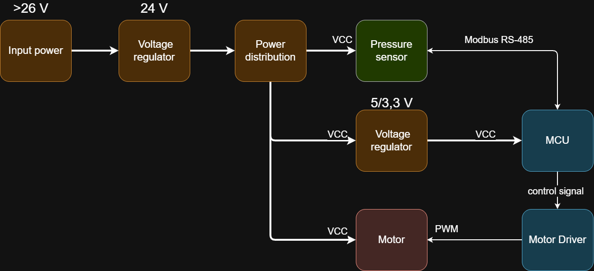

# Arvutite-ja-systeemide-projekt-2026

**Pressure Control mock-up**
A closed-loop control system for regulating air pressure to a configurable setpoint by driving a fan.

## Overview

#### Block diagram

## Project structure

- docs - contains documentation markdown files
- src - firmware code folder
- schematics - diagrams and KiCad projects

## Documentation

-  [components](docs/components.md) - bill of materials, links, vendors and prices
- [qbm68-sensor](docs/qbm68-sensor.md) - documentation on the siemens sensor, usage in the project, troubleshooting, etc...
- [fan-control](docs/fan-control.md) - fan control solutions, schematics
- [power](docs/power) - regulator and voltage rails
