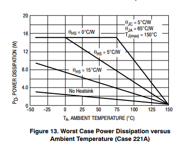

Documentation on the power solutions used, reference the block diagram.
### Input Voltage Regulation

#### Prototype
IC regulator with minimal configuration:
### [MC7824CT](https://www.mouser.com/catalog/specsheets/mc7800-d.pdf)

With no heatsink at 50 degrees 1.8 W dissipation is the worst case. Using $\theta_{JA}$ = $65 \degree C/W$ and $\theta_{JC} = 5 \degree C/W$, summing them up gives $70 \degree C/W$ and headroom of $80 \degree C/W$. Considering the 12 V mock-up fan speed at maximum takes (depending on the fan):
- fan motor - 200 mA - 500 mA
- qbm68 sensor - 25 mA
- Pico 2 microcontroller 40 mA (over 100 mA when using radio)

Assuming a powerful fan and no radio that would be 600 mA. A linear regulator of more than 3 V would need a heatsink. 

#### PCB

PCB design would work from wall socket and we are not certified to handle 240 VAC and its out of scope of this project. We assume a barrel jack 24 VDC input.
- https://www.amazon.com/LEDwholesalers-100-240V-5-5x2-1mm-Converter-3206-24V/dp/B002LMQ6G2?th=1

Another option to consider is using a miniature 240 VAC converter such as these from MEAN WELL
- https://www.mouser.ee/en/ProductDetail/MEAN-WELL/IRM-15-24?qs=WkdRfq4wf1PZSEWhZtKDbQ%3D%3D

### Fan voltage regulation (Prototype only)

*IN PROGRESS!*

TI webtool for finding suitable buck regulator solutions: [WEBENCH](https://www.ti.com/tool/WEBENCH-CIRCUIT-DESIGNER)
### MCU Voltage regulation

*IN PROGRESS!*
